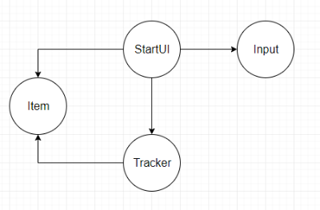

# job4j_di

### Описание проекта:

Простая реализация механизма DI (Depensency Injection).

Регистрируем классы в Contex, который в свою очередь создает для нас объекты этих классов.

### Стек технологий:

* Java 17
* Maven 3.8
* Junit 5
* AssertJ 3
* Spring 5

### Требования к окружению:

* Java 17
* Maven 3.8

---

### Контакты

telegram: [@svpoletaev](https://t.me/svpoletaev)

